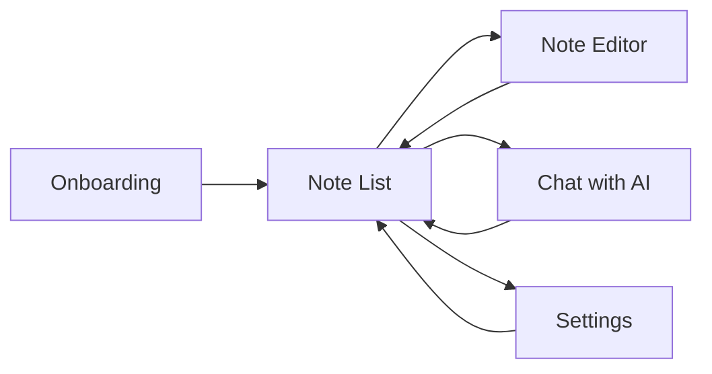

# Designer Brief: On-Device LLM Notes App

> **App Type:** Native Android Note-Taking App with AI Assistant  
> **Target Platform:** Android (Min SDK 26, Android 8.0+)  
> **Design System:** Material Design 3

---

## 1. App Overview

**On-Device LLM Notes** is an AI-powered note-taking app where all AI processing happens **locally on the device** — no cloud, no internet required. Users can take notes, search semantically, and chat with an AI assistant that understands their notes.

### Core Value Proposition
- 🔒 **Privacy-first**: All data stays on device
- 🤖 **AI-powered**: On-device LLM for smart features
- 📝 **Simple & Fast**: Quick note capture and retrieval
- 💬 **Chat with Notes**: Ask questions about your notes (RAG)

---

## 2. Navigation Flow

| Screen | Access |
|--------|--------|
| Onboarding | First launch only |
| Note List | Main screen (home) |
| Note Editor | Tap note or FAB |
| Chat | Top bar icon |
| Settings | Top bar icon |

---

## 3. Screen Specifications

### 3.1 Onboarding Screen

**Purpose:** Welcome new users, explain privacy features, optional Google Drive backup setup.

#### Elements
| Element | Type | Notes |
|---------|------|-------|
| Title | Text | "Welcome to On-Device LLM Notes" |
| Subtitle | Text | Privacy explanation |
| Google Drive Button | OutlinedButton | Optional backup connection |
| Connected Status | Text | Shows email when connected |
| Get Started Button | FilledButton | Primary CTA |

#### States
1. **Default**: Shows "Connect Google Drive" button
2. **Connected**: Shows connected email, button hidden

---

### 3.2 Note List Screen (Home)

**Purpose:** Display all notes, navigate to editor/chat/settings.

#### Header
| Element | Type | Icon | Action |
|---------|------|------|--------|
| Title | Text | — | "My Notes" |
| Chat Button | IconButton | Email/Chat | → Chat Screen |
| Settings Button | IconButton | Gear | → Settings |

#### Note Card
| Element | Type | Notes |
|---------|------|-------|
| Title | Text | Bold, 1 line, "Untitled Note" if empty |
| Content Preview | Text | 2 lines max, ellipsis overflow |
| Date | Text (small) | "MMM dd, yyyy" format |

#### Floating Action Button
| Element | Icon | Action |
|---------|------|--------|
| FAB | Plus (+) | → Create new note |

#### States
1. **Empty**: No notes message (needs design)
2. **Populated**: List of note cards
3. **Search mode**: (Future feature - search bar appears)

---

### 3.3 Note Editor Screen

**Purpose:** Create/edit notes with AI text completion.

#### Header
| Element | Type | Icon | Action |
|---------|------|------|--------|
| Back Button | IconButton | Arrow Left | Save & return |
| Title | Text | — | "Edit Note" |
| Save Button | IconButton | Checkmark | Save & return |

#### Content Area
| Element | Type | Notes |
|---------|------|-------|
| Title Input | OutlinedTextField | Single line |
| Content Input | OutlinedTextField | Full height, multiline |

#### AI Generate FAB
| Element | Icon | Color | Action |
|---------|------|-------|--------|
| FAB | Star ⭐ | Tertiary color | Generate AI completion |

#### States
1. **Editing**: Normal input mode
2. **Generating**: FAB shows loading spinner
3. **New Note**: Empty fields
4. **Existing Note**: Pre-filled fields

---

### 3.4 Chat Screen (RAG)

**Purpose:** Conversational AI that answers questions using context from user's notes.

#### Header
| Element | Type | Icon | Action |
|---------|------|------|--------|
| Back Button | IconButton | Arrow Left | Return to notes |
| Title | Text | — | "Chat with Notes" |

#### Message List
| Element | Type | Notes |
|---------|------|-------|
| User Message | Bubble | Right-aligned, primary container color |
| AI Response | Bubble | Left-aligned, secondary container color |

#### Message Bubble Specs
- Border radius: 12dp
- Max width: 280dp
- Padding: 12dp
- Background: primaryContainer (user) / secondaryContainer (AI)

#### Input Area (Bottom Bar)
| Element | Type | Notes |
|---------|------|-------|
| Text Input | OutlinedTextField | Placeholder: "Ask about your notes..." |
| Send Button | IconButton | Send icon, disabled when empty or loading |

#### States
1. **Empty**: No messages yet
2. **Conversation**: List of message bubbles
3. **Loading**: Send button shows spinner, disabled
4. **Error**: Error message as AI bubble

---

### 3.5 Settings Screen

**Purpose:** Model management, cloud backup settings.

#### Sections

##### Cloud Backup Section
| Element | Type | Action |
|---------|------|--------|
| Section Title | Text | "Cloud Backup" |
| Connect Button | OutlinedButton | Google Drive sign-in |

##### AI Models Section
| Element | Type | Notes |
|---------|------|-------|
| Section Title | Text | "AI Models" |
| Model Cards | List | Multiple model items |

#### Model Card States

**Not Downloaded:**
| Element | Type |
|---------|------|
| Model Name | Text |
| Download Button | FilledButton |

**Downloading:**
| Element | Type |
|---------|------|
| Model Name | Text |
| Progress Bar | LinearProgressIndicator |
| Progress Text | "Downloading... XX%" |

**Downloaded (Not Loaded):**
| Element | Type |
|---------|------|
| Model Name | Text |
| Status | "Downloaded" |
| Load Button | FilledButton |

**Loading:**
| Element | Type |
|---------|------|
| Model Name | Text |
| Status | "Loading..." |
| Spinner | CircularProgressIndicator |

**Active:**
| Element | Type |
|---------|------|
| Model Name | Text |
| Status | "Active Model" (primary color) |
| Button | Disabled "Loaded" |

---

## 4. Design System

### 4.1 Color Palette

#### Light Theme
| Token | Color | Hex | Usage |
|-------|-------|-----|-------|
| Primary | Purple | `#6650A4` | Buttons, links, active states |
| Secondary | Purple Grey | `#625B71` | Secondary actions |
| Tertiary | Pink | `#7D5260` | AI-related actions |
| Background | Off White | `#F5F5F5` | Screen background |

#### Dark Theme
| Token | Color | Hex | Usage |
|-------|-------|-----|-------|
| Primary | Light Purple | `#D0BCFF` | Buttons, links |
| Secondary | Light Purple Grey | `#CCC2DC` | Secondary |
| Tertiary | Light Pink | `#EFB8C8` | AI actions |
| Background | Dark Gray | `#1E1E1E` | Screen background |

> **Note:** Dynamic color (Material You) is enabled for Android 12+ devices.

### 4.2 Typography

| Style | Size | Weight | Line Height | Use Case |
|-------|------|--------|-------------|----------|
| titleLarge | 22sp | Normal | 28sp | Screen titles |
| titleMedium | — | — | — | Section titles, note titles |
| titleSmall | — | — | — | Card titles |
| bodyLarge | 16sp | Normal | 24sp | Main body text |
| bodyMedium | — | — | — | Note content preview |
| labelSmall | 11sp | Medium | 16sp | Dates, status labels |

### 4.3 Spacing

| Size | Value | Usage |
|------|-------|-------|
| xs | 4dp | Internal element spacing |
| sm | 8dp | Component gaps |
| md | 16dp | Section padding |
| lg | 24dp | Screen padding |
| xl | 32dp | Large section gaps |

### 4.4 Components

| Component | Notes |
|-----------|-------|
| Card | Full width, 8dp margin, 16dp internal padding |
| FloatingActionButton | Standard Material3 FAB |
| TopAppBar | Material3 TopAppBar |
| OutlinedTextField | Material3 default styling |
| Button | Material3 FilledButton |
| OutlinedButton | Material3 OutlinedButton |
| IconButton | Material3 IconButton |
| CircularProgressIndicator | Loading states |
| LinearProgressIndicator | Download progress |

---

## 5. Icons Needed

| Icon | Usage | Suggested Material Icon |
|------|-------|------------------------|
| Add | Create note FAB | `add` |
| Chat | Open chat | `chat` or `mail` |
| Settings | Open settings | `settings` |
| Back | Navigation back | `arrow_back` |
| Save/Check | Save note | `check` |
| Star | AI generate | `auto_awesome` |
| Send | Send message | `send` |
| Cloud | Cloud backup | `cloud` or `backup` |
| Download | Download model | `download` |
| Logo | App icon | Custom design needed |

---

## 6. Empty States (Design Needed)

| Screen | Empty State |
|--------|-------------|
| Note List | No notes yet - illustration + "Create your first note" |
| Chat | Welcome message - "Ask me anything about your notes" |

---

## 7. Future Features (Roadmap)

These features are planned but not yet implemented:

| Feature | Description |
|---------|-------------|
| Search | Text + vector (semantic) search with toggle |
| Tags | Categorize notes with colored tags |
| Markdown | Markdown rendering in notes and chat |
| Note Templates | Quick start templates for common use cases |
| Swipe Actions | Swipe to delete/archive notes |
| Sort Options | Sort by date, title, recently edited |

---

## 8. Key User Flows

### Flow 1: First Launch
1. User opens app → Onboarding Screen
2. (Optional) Connect Google Drive
3. Tap "Get Started" → Note List

### Flow 2: Create Note with AI
1. Note List → Tap FAB (+)
2. Enter title and start writing
3. Tap AI button (⭐) → AI continues text
4. Tap back/checkmark → Save and return

### Flow 3: Chat with Notes
1. Note List → Tap chat icon
2. Type question about notes
3. AI searches notes, provides answer with context
4. Continue conversation

### Flow 4: Download AI Model
1. Note List → Settings
2. Scroll to AI Models section
3. Tap Download → Progress bar shown
4. Download complete → Tap "Load Model"
5. Model becomes "Active"

---

## 9. Deliverables Requested

Please provide designs for the following:

1. **All 5 screens** (Onboarding, Note List, Note Editor, Chat, Settings)
2. **All states** for each screen (empty, loading, error, populated)
3. **Light and Dark theme** variants
4. **App icon** and splash screen
5. **Empty state illustrations**
6. **Component library** matching Material3

---

## 10. Technical Constraints

- Material Design 3 components
- Android native (Jetpack Compose)
- Min screen width: 320dp (phone)
- Max screen width: 600dp (before tablet layout needed)
- Status bar uses primary color
- Supports system-wide dark mode

---

*Document prepared for handoff to UI/UX designer.*
