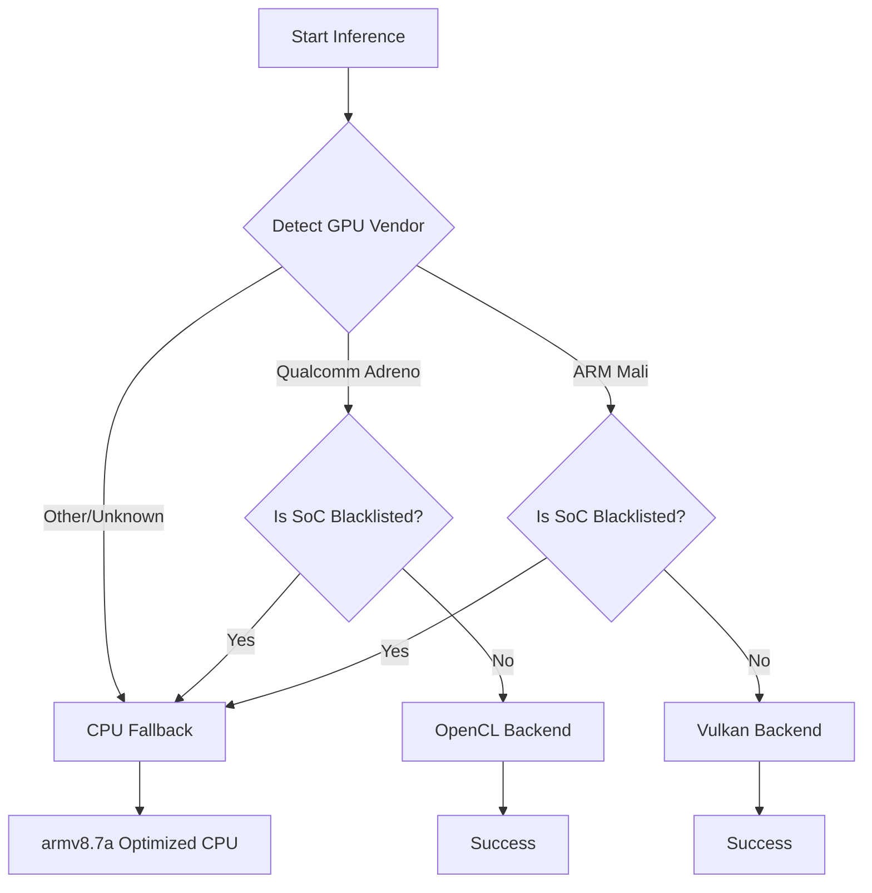

# Strategy Recommendation: Android LLM Backend Selection

**Date:** January 31, 2026  
**Status:** IMPLEMENTED
**Target:** Engineering Sprint 2026-Q1-02

## 1. Executive Summary
Currently, the `llama.cpp` integration in the Android Note App underutilizes GPU hardware, particularly on Mali-based devices (Samsung Exynos, MediaTek), where Vulkan is never auto-selected. Conversely, Qualcomm Adreno devices benefit from a recently upstreamed, highly optimized OpenCL backend that outperforms the generic Vulkan implementation.

This strategy proposes a tiered hardware-aware selection logic to maximize performance across the Android ecosystem while maintaining stability through a strict fallback chain.

## 2. Backend Selection Decision Tree



### Fallback Chain (Priority Order)
1.  **Qualcomm (Snapdragon):** `Adreno-OpenCL` → `CPU (armv8.7a)`
2.  **Mali (Exynos/MediaTek):** `Vulkan` → `CPU (armv8.7a)`
3.  **General/Unknown:** `CPU (armv8.7a)`

## 3. Implementation Logic

### Tier 1: Qualcomm Adreno (Optimized OpenCL)
- **Rationale:** Qualcomm's 2025 OpenCL backend contains specialized kernels for Adreno architecture, delivering peak performance.
- **Action:** Auto-select `backend_id = 2` (OpenCL) for Snapdragon SoCs.

### Tier 2: ARM Mali (Vulkan)
- **Rationale:** Vulkan provides a more stable and performant path for Mali GPUs compared to OpenCL, which often lacks optimized vendor kernels for these chips.
- **Action:** Fix current auto-selection logic to return `backend_id = 1` (Vulkan) for non-blacklisted Mali devices.

### Tier 3: CPU Fallback (armv8.2-a)
- **Rationale:** Stability is paramount. If a GPU is blacklisted or detection fails, the system must fallback to a highly optimized CPU path.
- **Action:** Compile with `-march=armv8.2-a+dotprod` to leverage dot product instructions while maintaining compatibility with S21+ era devices.

## 4. Safety & Stability (Blacklist)
Certain SoCs exhibit critical driver bugs or "device lost" errors with GPU backends. These must be forced to CPU or run with safety flags.

| SoC (ro.board.platform) | Device Example | Backend Action |
|-------------------------|----------------|----------------|
| `sm8450`, `sm8550`      | Snapdragon 8 Gen 1/2 | Force CPU or `GGML_VK_DISABLE_ASYNC` |
| `s5e9925`               | Exynos 2200 (Xclipse) | Force CPU |
| `gs201`, `zuma`         | Pixel 7/8 (Tensor) | Force CPU |

## 5. TDD Verification Checklist

Before and after implementation, the following commands must be used to verify backend selection.

### Phase 1: Static Verification (Pre-Inference)
- [ ] **Check Compiled Backends:** Verify Vulkan and OpenCL are both enabled in the build.
  ```bash
  # Check native-lib.so for symbols
  nm -D app/build/intermediates/merged_native_libs/debug/out/lib/arm64-v8a/libnative-lib.so | grep -E "vulkan|opencl"
  ```

### Phase 2: Runtime Verification (Inference)
- [ ] **Verify Auto-Selection on Adreno:**
  ```bash
  adb logcat -d | grep "LLAMA_CPP" | grep "backend selected: OPENCL"
  ```
- [ ] **Verify Auto-Selection on Mali:**
  ```bash
  adb logcat -d | grep "LLAMA_CPP" | grep "backend selected: VULKAN"
  ```
- [ ] **Verify Fallback on Blacklisted SoC:**
  ```bash
  # Trigger on a Pixel 7/8 or S22
  adb logcat -d | grep "LLAMA_CPP" | grep "problematic device detected, falling back to CPU"
  ```

### Phase 3: Memory & Performance
- [ ] **Monitor RAM Overhead (Vulkan):** Ensure RSS does not spike > 500MB over CPU baseline.
  ```bash
  adb shell "dumpsys meminfo com.synapsenotes.ai"
  ```

## 6. Scope Exclusions
- **No UI Changes:** This strategy is purely logic-based in the C++/JNI layer. No toggles or settings will be added to the user interface.
- **No Model Quantization Changes:** Selection strategy assumes standard GGUF formats.
- **No External Driver Updates:** Strategy relies on existing system drivers.

---
**Strategy Lead:** Antigravity (Antigravity-Gemini-3-Flash)  
**Verification Status:** Pending Implementation
